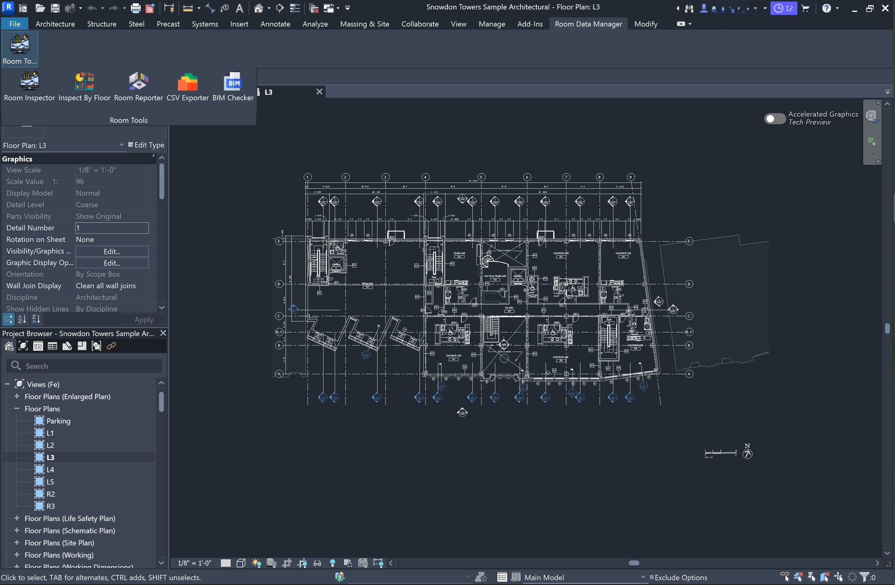
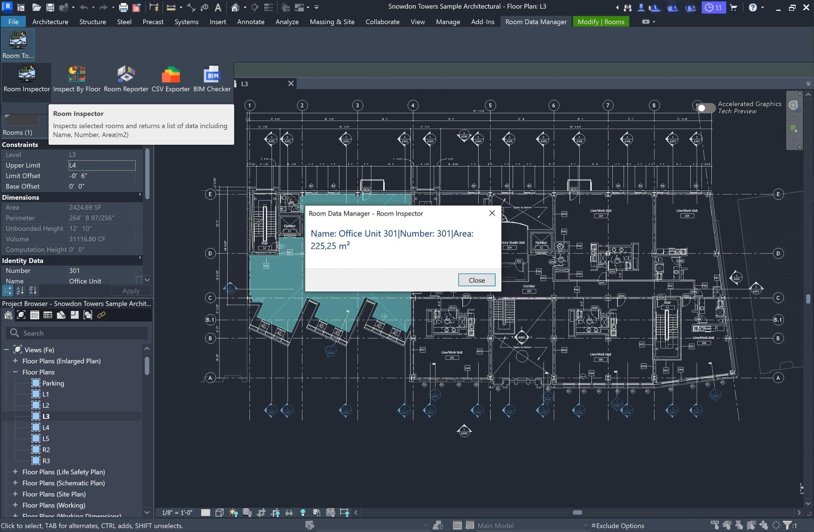
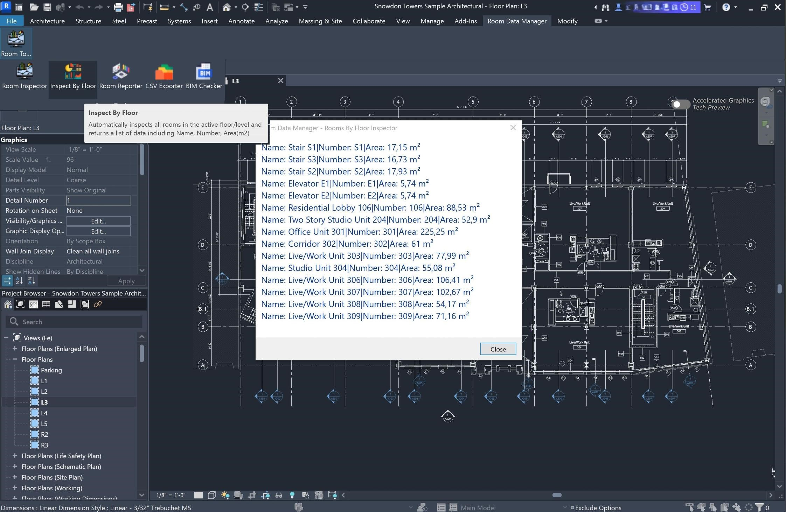
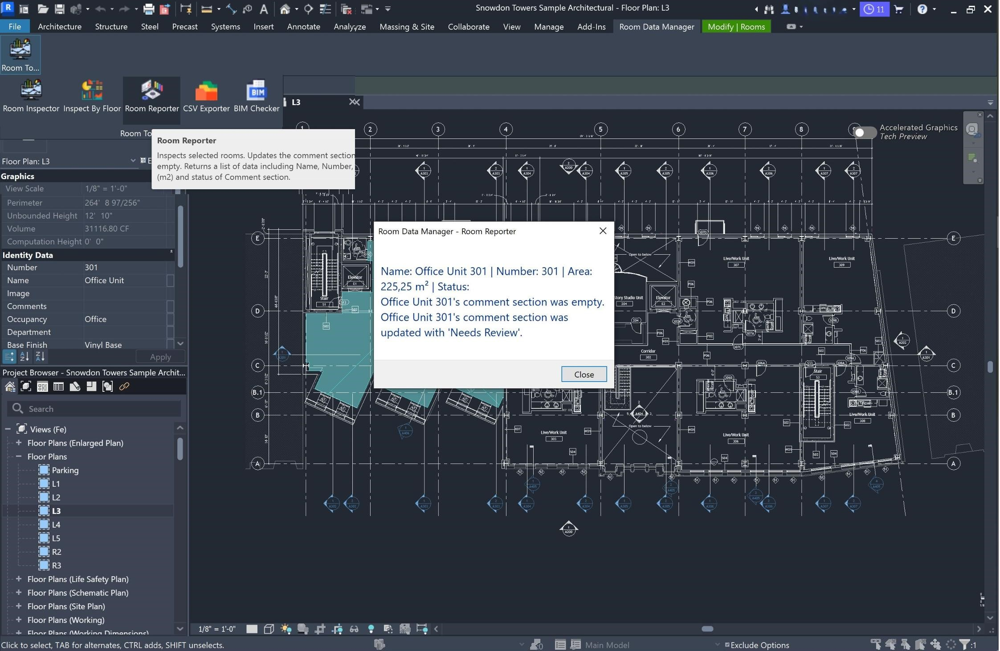
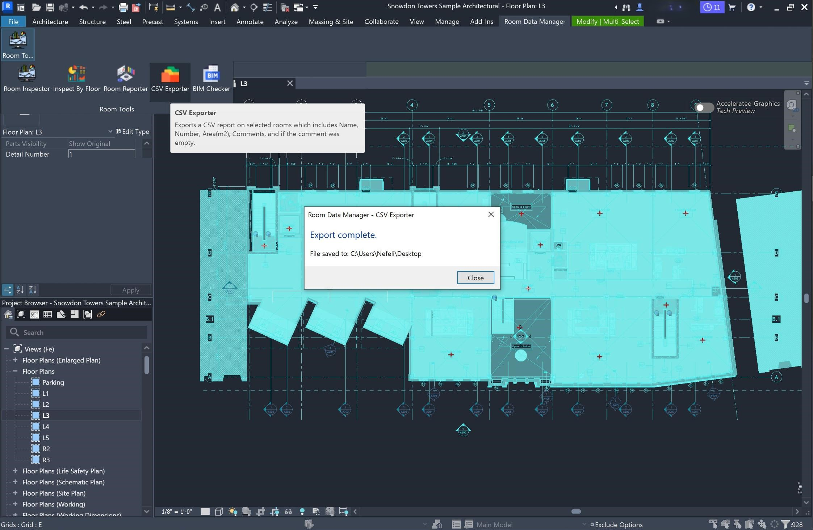
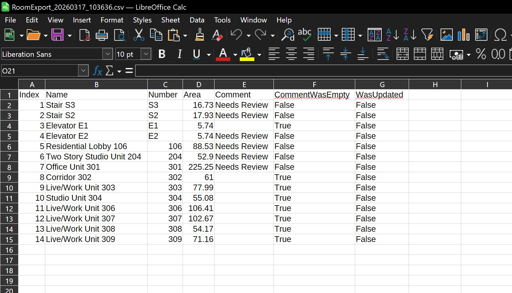
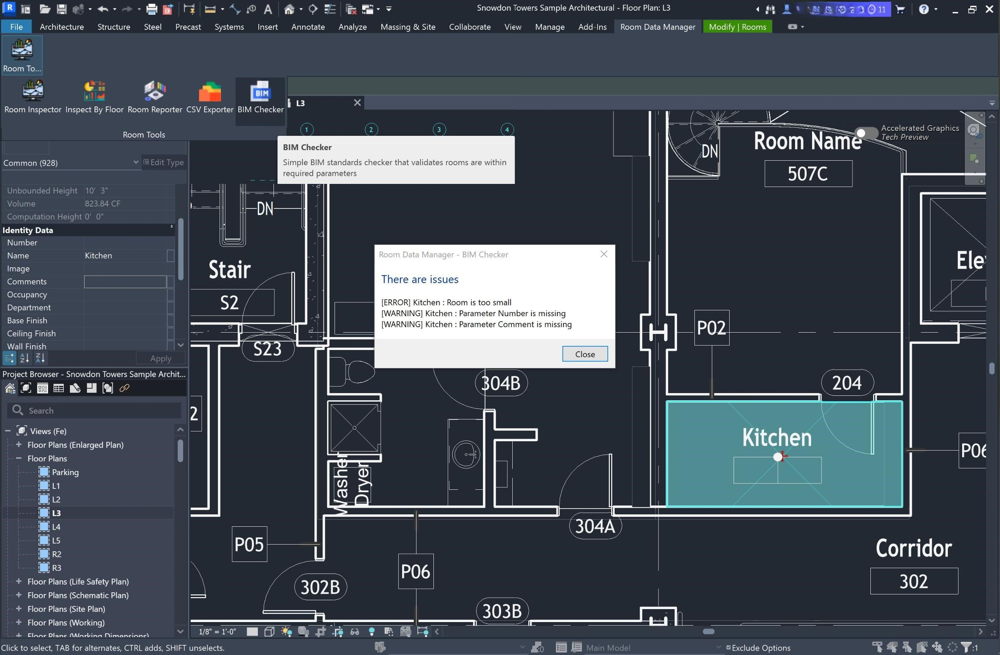

# Room Data Manager

A Revit 2026 add-in for inspecting, editing, and exporting room data.

---

## Requirements

- Autodesk Revit 2026
- Windows 10 or later
- .NET 8

---

## Installation

1. Download the latest release from [here](https://github.com/nefeliKa/RoomDataManager/releases)

2. Unzip it.

3. Copy the following files into your Revit add-ins folder:

```
C:\Users\<YourName>\AppData\Roaming\Autodesk\Revit\Addins\2026\
```

> To find your AppData folder, press `Win + R`, type `%appdata%`, and press Enter.

Files to copy:
- `RoomDataManager.dll`
- `RoomDataManager.addin`
- `bim_requirements.csv`

4. Launch Revit. A new tab called **Room Data Manager** will appear in the ribbon.

---

## Features

### Room Inspector
Select one or more rooms in the model and click this button to see a report of their name, number, area, and comments.


### Rooms by Floor
Displays a list of all rooms on the currently active floor plan view, with their key data (currently Room Name, Number, Area).



### Room Reporter
Selects rooms and writes a default comment ("Pending Review") to any room that has an empty comment field. Rooms that already have a comment are skipped.



### CSV Exporter
Exports room data (name, number, area, comments) to a `.csv` file saved on your Desktop. The file is timestamped so each export is kept separately.



### BIM Checker
Checks all selected rooms for common data issues:
- Missing name, number, or comment
- Area below the expected minimum for the room type

Minimum area requirements are read from `bim_requirements.csv` in your Revit add-ins folder. Edit that file to customise thresholds for your project. If the file is missing, built-in defaults are used.



Any issues found are written directly into the room's comment field in Revit, so they are visible in the model.

---

## Project Structure

```
NewAddinExercise/
├── Commands/           # One file per ribbon button — entry points for each feature
├── Checkers/           # BIM validation logic (interfaces, rules, and runner)
├── Exporters/          # CSV export logic (base class, interface, implementation)
├── Helpers/            # Shared utilities for reading room parameters and building reports
├── Resources/          # Button icons (.png) embedded in the add-in
├── App.cs              # Add-in entry point — registers the ribbon UI  with Revit
└── RoomDataManager.addin  # Revit manifest file that tells Revit how to load the add-in

RevitInstructions/      # Screenshots used in this README
```

---

## Troubleshooting

**The "Room Data Manager" tab does not appear in Revit**
- Check that both `RoomDataManager.dll` and `RoomDataManager.addin` are in the correct folder.
- Make sure you are using Revit 2026. The add-in will not load in other versions.

**A button does nothing when clicked**
- Make sure you have a floor plan view open and active before using the add-in.
- Some buttons require you to select rooms first. Select the rooms in the model, then click the button.

**The CSV file does not appear on my Desktop**
- Check that Revit has permission to write files to your Desktop. This can be blocked by company IT policies.
- Look for a file named `RoomExport_<timestamp>.csv` on your Desktop.

**An error appears when loading the add-in**
- A log file called `log.txt` is saved to your Desktop when something goes wrong at startup. 

---

## Icon Credits

Icons used in this add-in are sourced from [Flaticon](https://www.flaticon.com):

- **BIM Checker** — [Bim icons created by Freepik - Flaticon](https://www.flaticon.com/free-icons/bim)
- **Rooms by Floor** — [Analysis icons created by RaftelDesign - Flaticon](https://www.flaticon.com/free-icons/analysis)
- **Room Inspector** — [Big data icons created by xnimrodx - Flaticon](https://www.flaticon.com/free-icons/big-data)
- **CSV Exporter** — [Storage icons created by Freepik - Flaticon](https://www.flaticon.com/free-icons/storage)
- **Parameter Writer** — [Computer icons created by vectorsmarket15 - Flaticon](https://www.flaticon.com/free-icons/computer)
